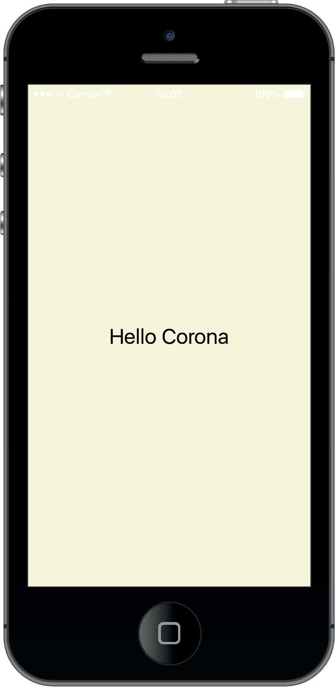

# [Corona] Hello World

Hello World in Corona.

## Usage

Use [Git](https://git-scm.com/) to clone this repo:

```
$ git clone https://github.com/cwchentw/CoronaHelloWorld.git
```

Run this program by reading *main.lua* with [Corona](https://coronalabs.com/product/):



## Copyright

2017 Michael Chen, Apache 2.0